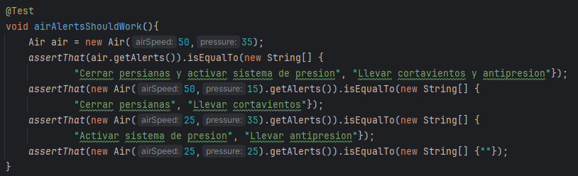

# Sprint 1

# Diseño e implementación inicial

Estructura de las clases del proyecto

`Clase Temperature`: Contiene la variable temperatura asi como futuros metodos para calcular eventos relacionados con esta misma

`Clase Rain`: Tiene como parametro la cantidad de lluvia y la humedad ademas maneja los metodos para calcular eventos relacionados con estas varibles

`Clase Air`: Controla los eventos relacionados con la velocidad del viento, la humedad

`Clase Weather`: Clase principal donde se llevara a cabo toda la logica

# Desarrollo con TDD

Para empezar a desarrollar la logica de nuestro proyecto usaremos TDD, creamos nuestro archivo de pruebas y los metodos para testear la funcionalidad

Al correr las pruebas fallan, entonces codeamos la logica necesaria para que pasen

Y ahora las pruebas pasan en verde, procedemos con la demas logica del proyecto.

Pruebas en rojo:

Logica para que las pruebas pasen:

Pruebas en verde:

# Validacion de pruebas con stubs y fakes

Creamos stubs y fakes para simular condiciones climaticas extremas

Y de igual manera para todas las clases

## Clase Rain

## Clase Temperature

# Refactorizacion y codigo limpio

Empezaremos refactorizando la clase Alert que se encarga de mostrar las alertas, esta dejara de ser una clase y sera una interfaz para seguir un patron en todas las clases, esto nos quitara la dependencia de la clase Alerts y evitara el uso redundante de su metodo event()

## Clase Air

Se quito el uso de la clase alert y se actualizo a una interfaz asi como tambien nos deshicimos del uso innecesario del metodo event()

De igual manera para las clases restantes

## Clase Rain

## Clase Temperature

Una vez terminada toda la refactorizacion corremos las pruebas para verificar que no se haya modificado el funcionamiento

# Metricas de calidad

Evaluamos la cobertura de pruebas con jacoco

Agregamos las pruebas faltantes para tener mas cobertura de codigo

## Clase Air

Cubrimos todos los casos posibles que hay entre la velocidad del aire y la presion asi como tambien el caso en que ni uno de los dos es elevado

## Clase Rain

Cubrimos todos los casos posibles que hay entre la cantidad de lluvia en mm y la humedad asi como tambien el caso en que ni uno de los dos es elevado

## Clase Temperature

Cubrimos los casos cuando la temperatura es alta o no

Una vez cubierto todos los casos posibles volvemos a hacer un build para ver nuestro reporte actualizado

Y se ve que ya tenemos una mejor cobertura

