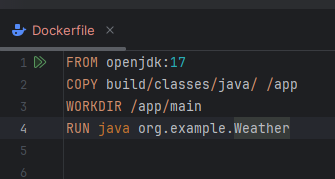
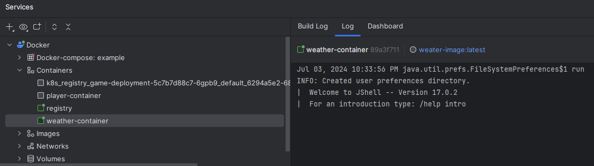

# Sprint 2

# Contenerizacion del Sistema

Dockerfile para contener nuestro proyecto

Ejecutamos el dockerfile para tener la imagen y el contenedor

# Refinamiento del TDD

Ejecutamos las pruebas en nuestro entorno dockerizado para verificar que pasen

